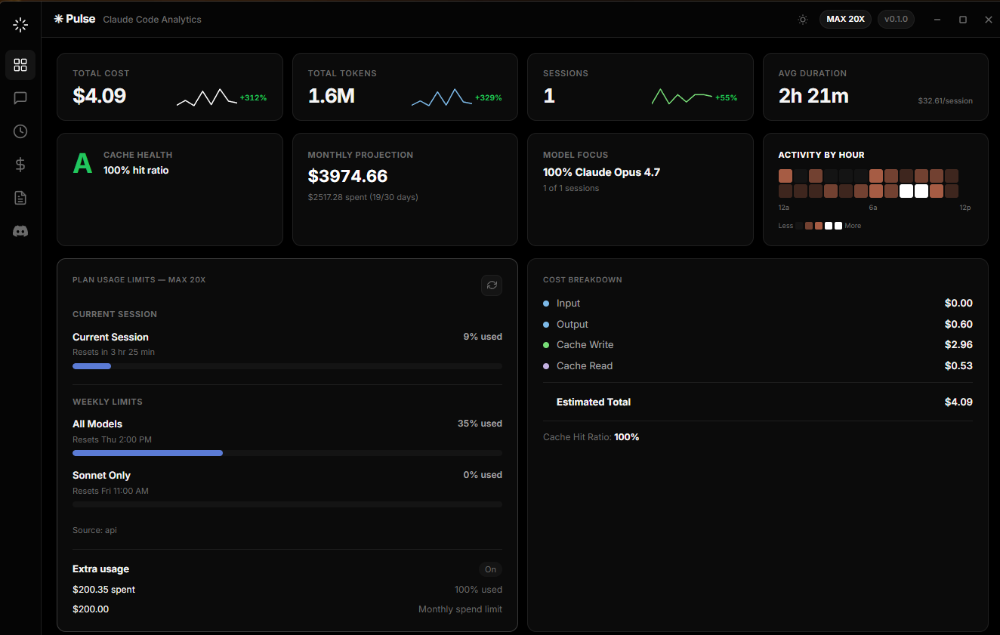
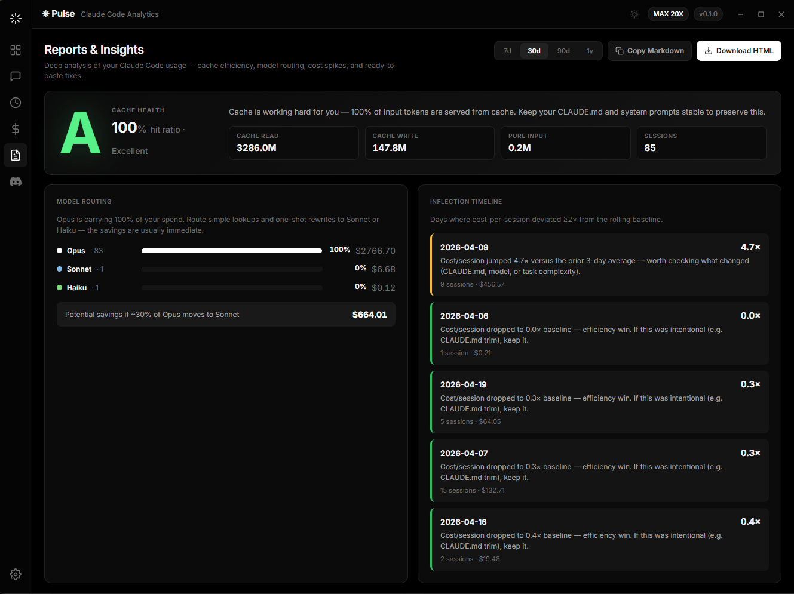

<div align="center">


# Pulse — Claude Code Analytics

**The beautiful, open-source analytics dashboard & Discord Rich Presence client for [Claude Code](https://claude.com/claude-code).**

Know exactly what your Claude Code sessions cost. Catch runaway spend before it happens. Grade your cache health. Share your flow state on Discord. All on your machine, zero telemetry.

[](https://github.com/xt0n1-t3ch/Pulse/actions/workflows/ci.yml)
[](https://github.com/xt0n1-t3ch/Pulse/actions/workflows/release.yml)
[](https://github.com/xt0n1-t3ch/Pulse/releases/latest)
[](https://github.com/xt0n1-t3ch/Pulse/releases)
[](LICENSE)
[](https://github.com/xt0n1-t3ch/Pulse/stargazers)
[](https://github.com/sponsors/xt0n1-t3ch)

[**Download**](#-install) · [**Features**](#-features) · [**Screenshots**](#-screenshots) · [**Docs**](docs/) · [**Sponsor**](https://github.com/sponsors/xt0n1-t3ch)

</div>

---

## ✨ Screenshots

<div align="center">

<br><sub><b>Dashboard</b> — at-a-glance cost · tokens · cache-hit ratio · plan limits · extra usage · activity heatmap.</sub>
<br><br>

<br><sub><b>Reports & Insights</b> — letter-grade cache health · rule-based recommendations · cost inflection detection · "Fix with Claude Code" one-click prompts.</sub>
</div>

---

## 🚀 Install

### Windows

**One-liner (PowerShell):**
```powershell
irm https://raw.githubusercontent.com/xt0n1-t3ch/Pulse/main/scripts/install.ps1 | iex
```

Or grab the installer from [Releases](https://github.com/xt0n1-t3ch/Pulse/releases/latest):

| Asset | Description |
| --- | --- |
| `Pulse_x.y.z_x64-setup.exe` | NSIS installer (recommended) |
| `Pulse_x.y.z_x64_en-US.msi` | MSI installer |

### macOS

**One-liner:**
```bash
curl -fsSL https://raw.githubusercontent.com/xt0n1-t3ch/Pulse/main/scripts/install.sh | bash
```

| Asset | Architecture |
| --- | --- |
| `Pulse_x.y.z_aarch64.dmg` | Apple Silicon (M1/M2/M3/M4) |
| `Pulse_x.y.z_x64.dmg` | Intel |

### Linux

**One-liner:**
```bash
curl -fsSL https://raw.githubusercontent.com/xt0n1-t3ch/Pulse/main/scripts/install.sh | bash
```

| Asset | Distro |
| --- | --- |
| `pulse_x.y.z_amd64.deb` | Debian / Ubuntu |
| `pulse-x.y.z-1.x86_64.rpm` | Fedora / RHEL |
| `pulse_x.y.z_amd64.AppImage` | Any (portable) |

### From source

```bash
git clone https://github.com/xt0n1-t3ch/Pulse.git
cd Pulse
cd frontend && npm install && npm run build && cd ..
cd src-tauri && cargo tauri build
```

---

## 🎯 Features

### Analytics Dashboard (GUI)

- **Cost tracking** — accurate cost per session, per day, per model. No guesswork.
- **Cache health grading** — A–F letter grade based on trend-weighted hit ratio. cchubber-style.
- **Model routing insights** — Opus/Sonnet/Haiku split + potential savings estimate.
- **Inflection detection** — flags ≥2× cost-per-session deviations before they become surprise bills.
- **Recommendations engine** — actionable fixes with **"Copy Fix Prompt"** buttons — paste straight into Claude Code.
- **Plan usage** — current session · weekly · Sonnet-only · Extra Usage monthly spend limits.
- **Heatmap · Sparklines · Charts** — all-local Chart.js, no network.
- **Reports export** — HTML & Markdown, one click.

### Discord Rich Presence

- Live project · git branch · model · reasoning effort · activity on your Discord profile.
- Session duration timer, token/cost fields, multi-tier asset resolver.
- Five reasoning tiers (Low/Medium/High/Extra High/Max) — Opus 4.7 support.
- Minimal / Standard / Full presets.

### Privacy & ownership

- **100% local.** No telemetry, no phone-home. Your session data never leaves your machine.
- SQLite analytics DB at `~/.claude/pulse-analytics.db` — yours to inspect, export, or delete.
- MIT licensed.

---

## 🧠 What makes Pulse different?

| | Pulse | Generic dashboards |
| --- | --- | --- |
| **Opus 4.7 tokenizer awareness** | ✅ Flags inflated token counts | ❌ |
| **1M context GA pricing** | ✅ Automatic (Opus 4.6+/Sonnet 4.6+) | ❌ |
| **cchubber-style cache health grade** | ✅ A–F with trend weighting | ❌ |
| **"Fix with Claude Code" prompts** | ✅ One-click clipboard | ❌ |
| **Zero-config** | ✅ Reads JSONL transcripts directly | Requires setup |
| **Discord Rich Presence** | ✅ Five-tier asset resolver | ❌ |
| **Native desktop (no Electron bloat)** | ✅ Tauri 2 + Rust | ❌ |
| **Open source** | ✅ MIT | Varies |

---

## 📸 About

**Pulse** is built for developers who live in Claude Code and want full transparency on what each session costs, how efficient their context/cache usage is, and where the next model-routing win hides. It replaces the guesswork ("did I just spend $40 on cache misses?") with a letter grade and a ready-to-paste fix prompt.

Written in **Rust 2024** + **Tauri 2.0** + **Svelte 5**, Pulse feels like a native app because it *is* one — ~12 MB on Windows, ~18 MB macOS, starts in under 200 ms. The data pipeline reads Claude Code's own JSONL transcripts (zero-config) and enriches them with the Anthropic Usage API when available.

---

## 🛠️ Usage

### First launch
1. Install Pulse.
2. Launch — Pulse auto-detects your `~/.claude/` data folder.
3. Use Claude Code normally — sessions stream in live.

### Discord Rich Presence
1. Open the **Discord** tab in Pulse.
2. Pick a preset (Minimal · Standard · Full) or customize fields.
3. Toggle on → your presence updates live.

See [docs/discord-assets.md](docs/discord-assets.md) for custom presence artwork.

### Reports
1. Open the **Reports** tab.
2. Review your **cache grade** + recommendation list.
3. Click **Copy Fix Prompt** on any item → paste into Claude Code → done.
4. Export via **HTML** / **Markdown** for your team.

---

## 🗺️ Roadmap

- [ ] Linux AppIndicator tray icon
- [ ] MCP server inventory view
- [ ] Team/workspace rollups (opt-in, still local-first)
- [ ] Custom budget alerts with desktop notifications
- [ ] Claude.ai (web) session import
- [ ] VS Code companion extension

Track progress on the [project board](https://github.com/xt0n1-t3ch/Pulse/projects).

---

## 🤝 Contributing

PRs welcome. See [CONTRIBUTING.md](CONTRIBUTING.md) for dev setup, coding style, and release process. Please read the [Code of Conduct](CODE_OF_CONDUCT.md) first.

---

## 💛 Sponsor

If Pulse saves you money (or sanity), consider sponsoring its development:

[](https://github.com/sponsors/xt0n1-t3ch)

Every contribution goes toward faster releases, better analyzers, and keeping Pulse free & open-source.

---

## 🔒 Security

See [SECURITY.md](SECURITY.md) for the responsible-disclosure policy.

---

## 📄 License

[MIT](LICENSE) © xt0n1-t3ch

---

<div align="center">
<sub>Built with ☕ and Claude Code · <a href="https://github.com/xt0n1-t3ch/Pulse">github.com/xt0n1-t3ch/Pulse</a></sub>
</div>
