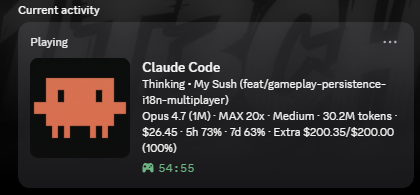

<div align="center">

<picture>
  <source media="(prefers-color-scheme: dark)" srcset="assets/pulse-logo-dark.svg">
  <source media="(prefers-color-scheme: light)" srcset="assets/pulse-logo-light.svg">
  
</picture>

### See where every Claude Code dollar actually goes.

The open-source **Claude Code analytics dashboard** + **Discord Rich Presence** for devs on **Claude Pro**, **Max**, and **Teams**.<br>Grade your cache A – F, catch runaway sessions before they burn your plan, and copy one-click <i>Fix with Claude Code</i> prompts. Native desktop. 100 % local. Zero telemetry.

[](https://github.com/xt0n1-t3ch/Pulse-Claude-Code-Analytics/actions/workflows/ci.yml)
[](https://github.com/xt0n1-t3ch/Pulse-Claude-Code-Analytics/actions/workflows/release.yml)
[](https://github.com/xt0n1-t3ch/Pulse-Claude-Code-Analytics/releases/latest)
[](https://github.com/xt0n1-t3ch/Pulse-Claude-Code-Analytics/releases)
[](LICENSE)
[](https://github.com/xt0n1-t3ch/Pulse-Claude-Code-Analytics/stargazers)
[](https://github.com/sponsors/xt0n1-t3ch)

<a href="#install"><b>Download</b></a>&nbsp; · &nbsp;<a href="#about"><b>About</b></a>&nbsp; · &nbsp;<a href="#screenshots"><b>Screenshots</b></a>&nbsp; · &nbsp;<a href="#features"><b>Features</b></a>&nbsp; · &nbsp;<a href="docs/"><b>Docs</b></a>&nbsp; · &nbsp;<a href="https://github.com/sponsors/xt0n1-t3ch"><b>Sponsor</b></a>

</div>

---

<h2 id="about"> &nbsp;About</h2>

You pay for Claude Code every month. Maybe $20 on **Pro**, $100 – $200 on **Max**, or a seat on **Teams**. And yet, if someone asked *"which of your sessions burned the most context this week?"* or *"what percentage of your tokens are actually cache hits?"* — you probably can't answer.

**Pulse answers.** It reads Claude Code's own JSONL transcripts (zero-config — just install and launch) and surfaces the things that actually move the needle on your plan:

- **A – F cache-health letter grade** — trend-weighted, so you see the *direction* your cache efficiency is heading, not just today's number.
- **Opus-4.7-tokenizer aware** — Opus 4.7's new tokenizer inflates tokens by up to 35 %; Pulse flags the inflation so you know when you're hitting limits faster than expected.
- **1 M context GA pricing** — flat per-token rate across the full 1 M window for **Opus 4.6 · Opus 4.7 · Sonnet 4.6** (per [Anthropic's official pricing](https://console.anthropic.com/docs/en/about-claude/pricing), effective 2026-03-13). Older betas (Sonnet 4 / 4.5, Opus 4 / 4.5) still get 2× input · 1.5× output · 2× cache at > 200 K. Pulse applies the correct math per-model so you compare sessions like-for-like. Plan-level **Extra Usage** on Pro / Max / Teams is tracked separately.
- **Inflection alerts** — any session that blows past 2 × your rolling baseline gets flagged with context and a suggested fix.
- **Fix-with-Claude prompts** — every recommendation has a **Copy Fix Prompt** button. Paste it into Claude Code. Problem fixed.
- **Plan usage limits** — live tracking of your current-session, weekly, Sonnet-only, and Extra Usage quotas. Sound alert when Extra Usage spikes.
- **Discord Rich Presence** — five-tier reasoning effort, live project / model / branch. Your flow state, on your profile.

Written in **Rust** + **Tauri 2** + **Svelte 5**. ≈ 12 MB on Windows, ≈ 18 MB on macOS. Cold-starts in under 200 ms. One-click installers for Windows (NSIS + MSI), macOS (DMG — Apple Silicon + Intel), and Linux (deb, rpm, AppImage). Apache-2.0 licensed (attribution required — see [`NOTICE`](NOTICE)). The data never leaves your machine.

<h2 id="screenshots"> &nbsp;Screenshots</h2>

<div align="center">


<sub><b>Dashboard</b> — at-a-glance cost · tokens · cache-hit ratio · plan limits · extra usage · activity heatmap.</sub>

<br><br>


<sub><b>Reports & Insights</b> — letter-grade cache health · rule-based recommendations · cost inflection detection · one-click <i>Fix with Claude Code</i> prompts.</sub>

<br><br>



<sub><b>Discord Rich Presence</b> — live model · reasoning effort · project · branch · tokens · cost · 5 h / 7 d / Extra Usage, right on your profile.</sub>

</div>

<h2 id="install"> &nbsp;Install</h2>

### Windows

```powershell
irm https://raw.githubusercontent.com/xt0n1-t3ch/Pulse-Claude-Code-Analytics/main/scripts/install.ps1 | iex
```

Or grab an installer from the [latest release](https://github.com/xt0n1-t3ch/Pulse-Claude-Code-Analytics/releases/latest):

| Asset | Description |
| :--- | :--- |
| `Pulse_x.y.z_x64-setup.exe` | NSIS installer — recommended |
| `Pulse_x.y.z_x64_en-US.msi` | MSI installer |

### macOS

```bash
curl -fsSL https://raw.githubusercontent.com/xt0n1-t3ch/Pulse-Claude-Code-Analytics/main/scripts/install.sh | bash
```

| Asset | Architecture |
| :--- | :--- |
| `Pulse_x.y.z_aarch64.dmg` | Apple Silicon (M1 / M2 / M3 / M4) |
| `Pulse_x.y.z_x64.dmg` | Intel |

### Linux

```bash
curl -fsSL https://raw.githubusercontent.com/xt0n1-t3ch/Pulse-Claude-Code-Analytics/main/scripts/install.sh | bash
```

| Asset | Distro |
| :--- | :--- |
| `pulse_x.y.z_amd64.deb` | Debian / Ubuntu |
| `pulse-x.y.z-1.x86_64.rpm` | Fedora / RHEL |
| `pulse_x.y.z_amd64.AppImage` | Any (portable) |

### From source

```bash
git clone https://github.com/xt0n1-t3ch/Pulse-Claude-Code-Analytics.git
cd Pulse-Claude-Code-Analytics
cd frontend && npm install && npm run build && cd ..
cd src-tauri && cargo tauri build
```

<h2 id="features"> &nbsp;Features</h2>

### Analytics dashboard

| | |
| :--- | :--- |
| **Accurate cost math** | Per session · day · model. Published pricing for every Claude — Opus 4.7, 4.6, 4.5, 4.1, 4, 3; Sonnet 4.6, 4.5, 4; Haiku 4.5, 3.5, 3. Compare like-for-like whatever plan you're on. |
| **A – F cache health grade** | Trend-weighted hit ratio — cchubber-style. See your direction, not just your current number. |
| **Model routing insights** | Opus / Sonnet / Haiku split + *"you could save $X by rerouting N sessions to Sonnet"* estimate. |
| **Inflection detection** | Any session ≥ 2 × baseline cost-per-session gets flagged with context. |
| **Recommendations engine** | Every finding has a **Copy Fix Prompt** button. Paste it into Claude Code. Problem fixed. |
| **Plan usage limits** | Current session · weekly all-models · Sonnet-only · Extra Usage monthly spend. Auto-detects Pro / Max / Teams. Sound alert on Extra Usage spikes. |
| **Heatmap · sparklines · charts** | All-local Chart.js. Zero network. |
| **Reports export** | Branded HTML + Markdown. One click. |

### Discord Rich Presence

| | |
| :--- | :--- |
| **Live fields** | Project · git branch · model · reasoning effort · activity status. |
| **Session timer** | Elapsed since start. Persists through Discord restarts. |
| **Reasoning tiers** | Five tiers (Low / Medium / High / Extra High / Max) — Opus 4.7 native. |
| **Asset resolver** | Multi-tier — portal keys → Media Proxy → plain URLs → fallback. |
| **Presets** | Minimal · Standard · Full. Customize per-field too. |

### Privacy & ownership

- **100 % local.** Your session data never leaves your machine. No telemetry, no phone-home, no cloud.
- **SQLite at `~/.claude/pulse-analytics.db`** — yours to inspect, export, back up, or delete.
- **Apache-2.0 licensed** with required attribution. Fork it, audit it, ship your own version — just keep the [`NOTICE`](NOTICE) file and credit the original author per the license.

<h2> &nbsp;What makes Pulse different</h2>

| | Pulse | Generic dashboards |
| :--- | :---: | :---: |
| Opus 4.7 tokenizer awareness (flags inflated counts) | ✓ | — |
| 1 M context pricing correctly applied per model (GA flat vs. beta surcharge) | ✓ | — |
| A – F cache health grade (trend-weighted) | ✓ | — |
| *Fix with Claude Code* one-click prompts | ✓ | — |
| Zero-config — reads JSONL transcripts directly | ✓ | setup required |
| Discord Rich Presence | ✓ | — |
| Native desktop (Tauri 2 + Rust, no Electron bloat) | ✓ | — |
| Open source | Apache-2.0 | varies |

<h2 id="usage"> &nbsp;Usage</h2>

**First launch** → install Pulse → launch → it auto-detects your `~/.claude/` folder → keep using Claude Code; sessions stream in live.

**Discord Rich Presence** → open the **Discord** tab → pick a preset (Minimal · Standard · Full) or customize fields → toggle on. Custom presence artwork in [`docs/discord-assets.md`](docs/discord-assets.md).

**Reports** → open the **Reports** tab → read your cache grade + recommendations → click **Copy Fix Prompt** on any item → paste into Claude Code → done. Export HTML / Markdown for your team.

<h2 id="roadmap"> &nbsp;Roadmap</h2>

- **Linux tray icon** — system-tray quick toggles (Discord presence on/off, pause analytics, open dashboard) via Tauri's `tray-icon` feature. Parity with the Windows tray.
- **MCP server inventory** — list every MCP server Claude Code has loaded for each session, with its tool count, per-tool invocation frequency, and an estimated token cost per tool call. Helps spot noisy MCPs silently inflating your context.
- **Budget-threshold desktop notifications** — native OS notification when you cross configurable thresholds (e.g. "80 % of weekly limit", "Extra Usage just passed $150 of your $200 cap"). Replaces eyeballing the dashboard.
- **Custom Discord presence templates** — save / share named field layouts beyond Minimal · Standard · Full. Export a preset as JSON; import one from a teammate.
- **Session replay** — step through a past session's prompts and tool-call timeline with the same filters the live dashboard uses. Currently the data is there (JSONL traces) but there's no dedicated UI.
- **Smarter cost forecast** — weekly-reset-aware projections with a confidence band, instead of today's linear daily-average multiplication.

Track on the [project board](https://github.com/xt0n1-t3ch/Pulse-Claude-Code-Analytics/projects).

<h2 id="contributing"> &nbsp;Contributing</h2>

PRs welcome. [`CONTRIBUTING.md`](CONTRIBUTING.md) has the dev setup, style guide, and release process. Please read the [Code of Conduct](CODE_OF_CONDUCT.md) first.

<h2 id="sponsor"> &nbsp;Sponsor</h2>

If Pulse saves you money (or sanity), sponsor its development:

[](https://github.com/sponsors/xt0n1-t3ch)

Every contribution goes toward faster releases, better analyzers, and keeping Pulse free and open-source forever.

<h2 id="security"> &nbsp;Security</h2>

Responsible-disclosure policy in [`SECURITY.md`](SECURITY.md). Report privately via [GitHub Security Advisories](https://github.com/xt0n1-t3ch/Pulse-Claude-Code-Analytics/security/advisories/new).

<h2 id="license"> &nbsp;License</h2>

[Apache-2.0](LICENSE) © 2026 xt0n1-t3ch. Use Pulse for anything (personal or commercial) — but per the license you must keep the copyright notice and the [`NOTICE`](NOTICE) file with original-author attribution in any redistribution or derivative work.

---

<div align="center">
<sub>Built with Rust, Tauri, Svelte, and Claude Code. &nbsp; · &nbsp; <a href="https://github.com/xt0n1-t3ch/Pulse-Claude-Code-Analytics">github.com/xt0n1-t3ch/Pulse-Claude-Code-Analytics</a></sub>
</div>
