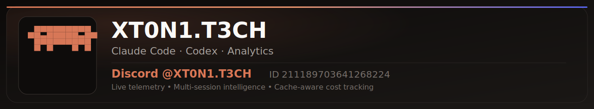

# Claude Code Discord Presence

<p align="center">
  
</p>

<p align="center">
  <a href="https://github.com/xt0n1-t3ch/Claude-Code-Discord-Presence/releases"></a>
  <a href="LICENSE"></a>
  
  
  
</p>

<p align="center"><strong>Real-time Discord Rich Presence for Claude Code sessions.</strong></p>

## Overview

`cc-discord-presence` monitors local Claude Code session JSONL files, detects live activity (`Thinking`, `Reading`, `Editing`, `Running`, `Waiting for input`), renders an adaptive terminal dashboard with colored usage bars, and updates Discord Rich Presence with accurate token and cost tracking — including prompt cache tokens.

## Core Capabilities

- **Live activity detection** with action-first Discord details and deterministic truncation.
- **Cache-aware cost tracking** — includes `cache_creation` and `cache_read` tokens at correct pricing tiers.
- **Adaptive terminal dashboard** — Full, Compact, and Minimal layouts based on terminal size.
- **Colored usage bars** — green/yellow/red thresholds for 5-hour and 7-day rate limits.
- **Multi-session support** — tracks all active Claude Code instances simultaneously.
- **Cross-platform** — Windows, macOS, Linux with platform-native Discord IPC.

## Platform Support

| Platform              | Status    |
| --------------------- | --------- |
| Windows (x64)         | Tested    |
| macOS (Apple Silicon) | Tested    |
| macOS (Intel)         | Supported |
| Linux (x64)           | Supported |
| Linux (ARM64)         | Supported |

> **Windows users**: Requires [Git Bash](https://git-scm.com/downloads) for automatic plugin hooks. Alternatively, run the PowerShell scripts manually (`scripts/start.ps1` and `scripts/stop.ps1`).

## Install

### As a Claude Code Plugin (Recommended)

```bash
claude plugin marketplace add tsanva/cc-discord-presence
claude plugin install cc-discord-presence@cc-discord-presence
```

The plugin automatically starts on `SessionStart` and stops on `SessionEnd`.

### Build from Source

```bash
git clone https://github.com/xt0n1-t3ch/Claude-Code-Discord-Presence.git
cd Claude-Code-Discord-Presence
cargo build --release
```

Build output:

- Windows: `releases/.cargo-target/release/cc-discord-presence.exe`
- Linux/macOS: `releases/.cargo-target/release/cc-discord-presence`

### Download Release Binaries

- [Releases](https://github.com/xt0n1-t3ch/Claude-Code-Discord-Presence/releases)

## Usage

```bash
cc-discord-presence            # Run with interactive TUI
cc-discord-presence --headless # Run without terminal UI (daemon mode)
cc-discord-presence status     # Show current session status
cc-discord-presence doctor     # Diagnose configuration issues
```

## How It Works

The app reads session data from Claude Code in two ways:

### 1. JSONL Parsing (Zero Config)

By default, the app parses session transcript files from `~/.claude/projects/`. It extracts model, tokens (including prompt cache), cost, git branch, and activity from the JSONL stream. This works out of the box with no configuration.

### 2. Statusline Integration (Higher Accuracy)

For the most accurate token/cost data, configure the statusline integration to use Claude Code's own calculations.

<a name="statusline-setup"></a>

#### Statusline Setup

**Automatic** (requires `jq`):

```bash
~/.claude/plugins/cache/*/cc-discord-presence/*/scripts/setup-statusline.sh
```

**Manual**: Edit `~/.claude/settings.json`:

```json
{
  "statusLine": {
    "command": "~/.claude/statusline-wrapper.sh",
    "type": "command"
  }
}
```

Then copy `scripts/statusline-wrapper.sh` to `~/.claude/statusline-wrapper.sh`. Restart Claude Code after setup.

## Configuration

Config file: `~/.claude/discord-presence-config.json`

```json
{
  "schema_version": 3,
  "discord_client_id": "1455326944060248250",
  "plan": "max_20x",
  "poll_interval_seconds": 3,
  "display": {
    "large_image_key": "claude-code",
    "large_text": "Claude Code"
  },
  "privacy": {
    "show_project_name": true,
    "show_model": true,
    "show_tokens": true,
    "show_cost": true,
    "show_activity": true,
    "show_limits": true,
    "show_plan": true
  }
}
```

### Subscription Plans

| Plan ID   | Display           |
| --------- | ----------------- |
| `free`    | Free              |
| `pro`     | Pro ($20/mo)      |
| `max_5x`  | Max 5x ($100/mo)  |
| `max_20x` | Max 20x ($200/mo) |

### Environment Overrides

- `CC_DISCORD_CLIENT_ID`
- `CC_PRESENCE_STALE_SECONDS`
- `CC_PRESENCE_POLL_SECONDS`
- `CC_PRESENCE_ACTIVE_STICKY_SECONDS`

## Token Pricing

Cost is calculated using current Claude API pricing with full prompt caching support:

| Model        | Input /1M | Output /1M | Cache Write /1M | Cache Read /1M |
| ------------ | --------- | ---------- | --------------- | -------------- |
| Opus 4.5/4.6 | $15.00    | $75.00     | $18.75          | $1.50          |
| Sonnet 4/4.5 | $3.00     | $15.00     | $3.75           | $0.30          |
| Haiku 4.5    | $1.00     | $5.00      | $1.25           | $0.10          |

> Cache write = 1.25x base input price. Cache read = 0.10x base input price.

## Discord Asset Setup

1. The default shared app (`1455326944060248250`) works out of the box.
2. For a custom app: [Discord Developer Portal](https://discord.com/developers/applications) → New Application → copy Application ID → set in config.
3. Upload image assets: `claude-code` (large), optional per-activity small images.
4. `display.*_image_key` accepts an uploaded asset key or an `https://` image URL.

## Uninstallation

```bash
# Remove plugin
claude plugin uninstall cc-discord-presence@cc-discord-presence

# Remove statusline wrapper (if configured)
rm ~/.claude/statusline-wrapper.sh

# Restore original statusline
jq 'del(.statusLine)' ~/.claude/settings.json > /tmp/s.json && mv /tmp/s.json ~/.claude/settings.json
```

## Security and Privacy

- Reads local Claude Code session files only.
- No external telemetry or data collection.
- See [PRIVACY.md](PRIVACY.md) for details.

## Contributing

Contributions are welcome. See [CONTRIBUTING.md](CONTRIBUTING.md) for guidelines.

```bash
# Run tests before submitting PRs
cargo test
```

## Credits

<p align="center">
  
</p>

## Anthropic Brand Notice

- Anthropic marks and logos are trademarks of Anthropic.
- Follow official guidelines when distributing or configuring assets:
  - https://www.anthropic.com/brand

## License

MIT ([LICENSE](LICENSE))
