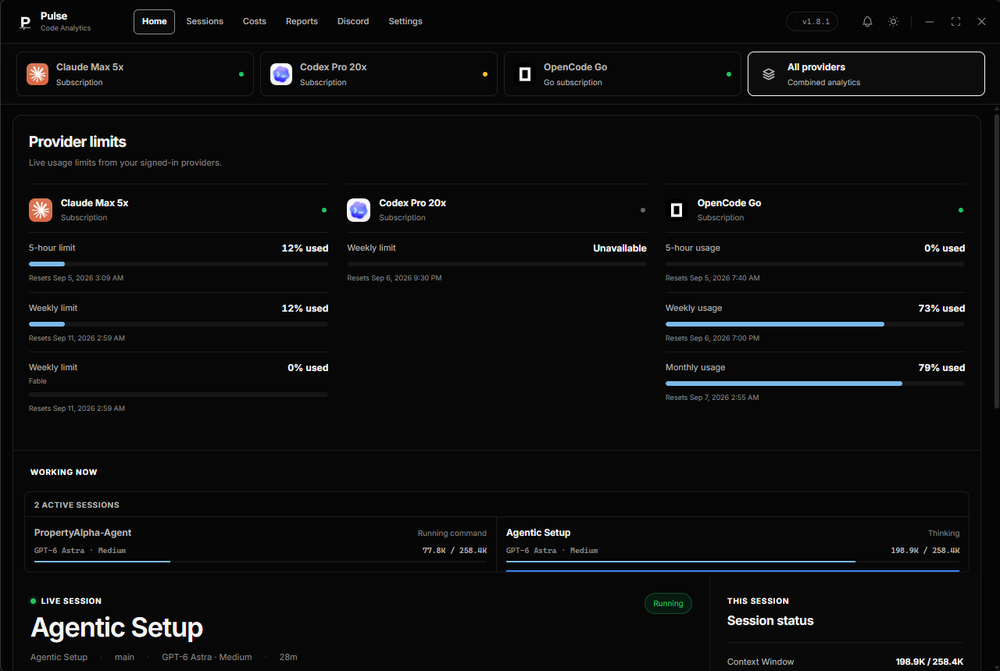
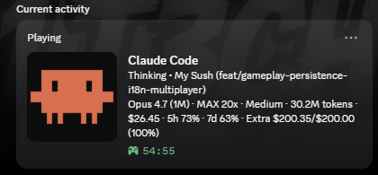
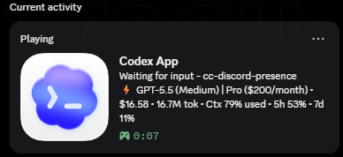

<!-- Landing page: help coding-tool users inspect Pulse, install it and find the relevant guide. -->
<div align="center">

<h1>
  <picture>
    <source media="(prefers-color-scheme: light)" srcset="assets/pulse-logo-dual-light.png">
    
  </picture>
</h1>
<h2>Your coding activity. One clear view.</h2>
<p>Local-first AI coding analytics and Discord Rich Presence for<br>Claude Code, OpenAI Codex and OpenCode.</p>

<p>
  <a href="https://github.com/xt0n1-t3ch/Pulse-Claude-Code-Analytics/releases/latest"></a>
  <a href="LICENSE"></a>
  <a href="src-tauri/Cargo.toml"></a>
</p>

<p><a href="#install"> Download</a> &middot; <a href="#preview"> Preview</a> &middot; <a href="#whats-new"> What's new</a> &middot; <a href="#use-pulse"> Use Pulse</a> &middot; <a href="docs/index.md"> Documentation</a></p>


</div>

| Live activity | Provider limits | Discord presence |
| --- | --- | --- |
| See your active project, model and session context. | Read account usage without mixing providers or session tokens. | Choose which application and fields your profile shares. |

Pulse is an open-source desktop dashboard for **Claude Code analytics, OpenAI Codex usage and OpenCode sessions**. Track tokens, API-equivalent costs, prompt-cache efficiency and account limits, then share selected live details through Discord Rich Presence.

Live activity, session history and account limits stay separate. Missing prices remain unavailable, not zero. Your session analytics stay on your machine.

<h2 id="preview">&nbsp; Preview</h2>

See provider limits and active sessions in the current Home view. Select the screenshot to inspect the original capture.

<p align="center">
<a href="assets/screenshots/pulse-home-v1.8.1.png"></a>
<br><sub>Provider limits and live sessions. Pulse 1.8.1 on Windows.</sub>
</p>

<details>
<summary>Explore earlier Discord previews</summary>

These repository captures show earlier Claude and Codex presence layouts. They are historical examples, not screenshots of the current Pulse interface.

<p align="center">
  <a href="assets/screenshots/discord-rich-presence.png"></a>
  <a href="assets/screenshots/codex-discord-rich-presence.png"></a>
</p>

</details>

<a id="whats-new-in-v180"></a>
<a id="whats-new-in-v181"></a>

<h2 id="whats-new">&nbsp; What's new</h2>

Pulse v1.8.2 adds refreshed provider documentation and a gated six-platform release process. It retains the 1.8 feature update and non-Windows compilation fix. Highlights:

- Track OpenCode sessions from local SQLite, including mixed-model history and provider-reported costs.
- See OpenCode Go limits for five-hour, weekly and monthly windows, separate from other providers.
- Identify GPT-6 Astra sessions, context and Standard/Fast pricing. Missing price coverage stays visible.
- Review seven days of activity by provider in a dashboard with dark and light themes.
- Manage notifications with read/unread controls and an Undo action that survives an app restart.
- Reduce background process priority with Windows Efficiency mode and EcoQoS.
- Customize OpenCode presence with model-first fields, saved field order and two-decimal currency. Completed sessions stop broadcasting.

See the [changelog](CHANGELOG.md) for the release history.

<h2 id="install">&nbsp; Install</h2>

Choose an installer for your operating system and architecture from [GitHub Releases](https://github.com/xt0n1-t3ch/Pulse-Claude-Code-Analytics/releases/latest).

| Platform | Release targets | Installer formats |
| --- | --- | --- |
| Windows | x64 and ARM64 | `.exe` (NSIS), `.msi` |
| macOS | Intel and Apple Silicon | `.dmg` |
| Linux | x64 and ARM64 | `.deb`, `.rpm`, `.AppImage` |

macOS GitHub packages are not Apple-signed or notarized. macOS may block first launch. Updater signatures are separate from Apple signing.

These are the required targets for a complete release, not a claim that every version has all six builds. **v1.8.1 currently contains Windows x64 installers only.** Its published files are immutable. macOS, Linux and Windows ARM64 need a later complete release, or a build from source.

Every complete release must include `SHA256SUMS.txt`, Windows software bills of materials and `latest.json` with signed updater payloads for all six targets. Do not install an asset for a different architecture to work around a missing download.

<details>
<summary>Windows installation</summary>

Download the matching `.exe` or `.msi`, compare its SHA-256 hash with `SHA256SUMS.txt`, then run the installer. Pulse uses Microsoft Edge WebView2. Windows Efficiency mode is specific to Windows.

For v1.8.1, the files are `Pulse_1.8.1_x64-setup.exe` and `Pulse_1.8.1_x64_en-US.msi`. The release also includes `pulse-windows-x64.spdx.json`.

</details>

<details>
<summary>macOS installation</summary>

When a matching release is available, download the Intel or Apple Silicon `.dmg`, verify its checksum and drag Pulse to Applications. The configured minimum is macOS 11.0.

These GitHub packages have no Apple Developer ID signature or notarization. Keep system security controls enabled; the native build checks do not establish Gatekeeper acceptance.

</details>

<details>
<summary>Linux installation</summary>

When a matching release is available, verify its checksum and install the package for your distribution and architecture. Debian-based systems use `.deb`; RPM-based systems use `.rpm`. AppImage is the standalone packaging option, not a promise of compatibility with every distribution.

The release builds use Ubuntu 22.04. GTK 3, WebKitGTK 4.1 and an AppIndicator-compatible desktop are required for the corresponding native features. Tray behavior depends on the desktop environment.

</details>

See [platform support and verification](docs/maintainers/platforms.md) for the release gate, runtime checks and known limits. Manual-only releases without `latest.json` cannot supply in-app updates.

<h2 id="use-pulse">&nbsp; Use Pulse</h2>

Start with your existing coding tools:

1. Open Claude Code, Codex or OpenCode.
2. Launch Pulse.
3. Select a provider, or choose **All providers** for combined analytics.
4. Open **Discord** to choose what your profile shares.

| View | Purpose |
| --- | --- |
| Home | Active sessions, provider limits, cache ratio and the last seven days of activity |
| Sessions | Live sessions and searchable, filtered history |
| Costs | Provider-billed spend and API-equivalent value, with their provenance |
| Reports | Provider-supported analysis and exports |
| Discord | Broadcast application, presets, field order and the backend-owned preview |
| Settings | Provider, plan display, appearance, window behavior and data controls |

Choosing a provider changes its workspace context. **All providers** combines analytics without changing the last broadcast application. The **Broadcast from** control in Discord makes publication ownership explicit.

A completed OpenCode session stays in history but leaves the live focus and Discord publisher. **Idle** does not borrow the last model, token count or monetary value. Unknown cost is unavailable; a provider-reported zero is displayed as `$0.00`.

<details>
<summary id="claude-code">Claude Code</summary>

Pulse reads your local Claude Code transcripts and optional statusline data. Review active sessions, token usage, prompt-cache efficiency and cost estimates in one workspace.

Claude subscription limits and Anthropic API access are separate sources. Account limits appear only after a successful provider check. Session tokens do not stand in for your remaining allowance.

The default data root is `~/.claude`; `CLAUDE_HOME` can override it. Subscription checks currently read `.credentials.json` from that root. Keychain-only credentials on macOS are not supported by this reader; local session analytics remain available.

See [plan detection](docs/guides/plans.md), [cost calculations](docs/guides/costs.md) and [troubleshooting](docs/guides/troubleshooting.md).

</details>

<details>
<summary id="codex">Codex</summary>

Pulse reads local Codex sessions and runtime metadata. Inspect the model, reasoning effort, context usage and recorded activity without combining them with Claude or OpenCode metrics.

Codex subscription limits and OpenAI API access remain separate. Pulse preserves provider-reported limit windows and marks unavailable costs or limits instead of inventing values.

The Codex integration uses `CODEX_HOME`, or `~/.codex` by default. **All providers** combines analytics without changing the application selected for Discord broadcasting.

See the [Codex model catalog](docs/models/codex.md), [context tracking](docs/guides/context.md) and [core integration](docs/maintainers/codex-core.md).

</details>

<details>
<summary id="opencode-and-go">OpenCode and Go</summary>

Pulse reads `opencode.db` and channel databases from OpenCode's local data directory. It supports both message-table schemas and respects `XDG_DATA_HOME` and `OPENCODE_DB`. Additional databases can be set in `~/.claude/pulse-opencode.json`.

When an existing OpenCode Go credential is available, Pulse requests its account usage from the Go API. Pulse does not copy that credential into its own settings or logs. The monthly window uses the provider's reset date rather than an invented fixed duration.

Desktop, CLI and OpenChamber can share this local store. Unknown client attribution remains OpenCode; a managed OpenChamber label requires matching process identity. Remote stores on other machines are outside this local integration. Read the [OpenCode and Astra guide](docs/guides/opencode.md) for the source and absence rules.

</details>

<details>
<summary id="discord-controls">Discord controls</summary>

Open Discord, choose a broadcast application in Pulse, and enable Rich Presence. Use **Minimal**, **Standard** or **Full**, then adjust individual fields. OpenCode defaults to model, activity, project and branch before its numeric fields. Field order controls priority within each Discord line.

Unavailable fields stay disabled. Go quotas identify Go explicitly and appear only while their data is fresh and the field is enabled. The profile preview uses the same Rust compositor as the publisher. The connected user's name and avatar come from local Discord IPC; an unavailable banner is not fabricated.

</details>

<details>
<summary id="notifications">Notifications</summary>

The bell opens the local notification history. You can mark one item or all items as read/unread, dismiss an item, or clear the list. **Clear all** requires confirmation and preserves the records. **Undo** restores the last confirmed clear and its original read states. The last Undo receipt survives an app restart on the same client.

If Pulse cannot refresh the history, it labels the retained snapshot and disables bulk changes until the connection recovers.

</details>

<details>
<summary id="windows-efficiency-mode">Windows Efficiency mode</summary>

Pulse requests EcoQoS and Idle process priority at startup. Windows owns the Task Manager leaf indicator; Pulse does not draw a substitute. Other operating systems keep their normal scheduling behavior.

Set this environment variable before launch to opt out:

```powershell
$env:PULSE_EFFICIENCY_MODE = "0"
```

See [Windows Efficiency mode](docs/maintainers/windows-efficiency.md) for behavior and the read-only verification command.

</details>

<h2 id="your-data-and-network-access">&nbsp; Your data and network access</h2>

Session analytics stay in `~/.claude/pulse-analytics.db`, or under `CLAUDE_HOME` when configured. Pulse reads local Claude/Codex transcripts and OpenCode SQLite records. It sends no analytics telemetry or transcript uploads.

Network use is limited to the configured provider quota checks, release/update checks and the Discord presence fields you enable. Project, branch and activity controls determine what the presence exposes. Keep private prompts, credentials and local reports out of public issues.

On Windows, WSL session discovery is off by default. Enable it only when you need those transcript roots:

```powershell
$env:CC_PRESENCE_INCLUDE_WSL = "1"
```

<h2 id="common-questions">&nbsp; Common questions</h2>

### Is Pulse a Claude Code cost tracker or a Codex dashboard?

Both, plus OpenCode. Each provider has its own data source, context rules and cost provenance. The combined view does not merge account allowances or treat subscription credits as API spend.

### Does Pulse need a separate account or API key?

Local session history does not need a Pulse account. Provider quota cards use existing supported credentials and require a successful provider check. Missing credentials do not erase local history. See [plans and access](docs/guides/plans.md).

### Does Pulse upload my prompts?

No transcript uploads or analytics telemetry. Session analytics remain local. Enabled provider quota checks, update checks and Discord presence still use the network. See [your data and network access](#your-data-and-network-access).

### Are the cost estimates my actual bill?

Not always. Pulse separates provider-reported cost from API-equivalent estimates. Model prices can change, and documented runtime pricing gaps remain. See [cost provenance](docs/guides/costs.md) before using estimates for a budget.

<h2 id="build-from-source">&nbsp; Build from source</h2>

Install Rust, Node.js, the Tauri CLI and the [Tauri platform prerequisites](https://v2.tauri.app/start/prerequisites/). Then run:

```powershell
git clone https://github.com/xt0n1-t3ch/Pulse-Claude-Code-Analytics.git
cd Pulse-Claude-Code-Analytics
npm --prefix frontend ci
npm run verify
npm run build:portable
```

`build:portable` compiles the frontend and runs `cargo tauri build --no-bundle`. The Tauri CLI enables `tauri/custom-protocol`, so the executable contains its UI. Do not promote a raw Cargo GUI build that still points at the development URL.

Use `npm run build` for installers. Use `npm run dev` for the authenticated, loopback-only browser development bridge. The development bridge is not required by the installed application.

<h2 id="compatibility-and-recovery">&nbsp; Compatibility and recovery</h2>

Pulse v1.8.2 uses Claude config schema 6, Codex config schema 13 and analytics schema 6. The analytics migration adds OpenCode metadata without discarding previous sessions.

Back up the executable, configuration and database through SQLite Backup before replacing an installation. Pulse 1.7.9 cannot open analytics schema 6: rollback requires the schema-5 backup, while the newer database should be preserved separately.

Pulse consumes `codex-presence-core` 2.0.0 through an immutable Git pin recorded in [UPSTREAM.json](src/codex/UPSTREAM.json). The standalone [Codex Discord Rich Presence](https://github.com/xt0n1-t3ch/Codex-Discord-Rich-Presence) runtime has its own releases and terminal interface.

See the [dependency audit scope](docs/maintainers/dependencies.md) for inherited Tauri advisories and platform boundaries.

<h2 id="contribute-and-report-problems">&nbsp; Contribute and report problems</h2>

Read [CONTRIBUTING.md](CONTRIBUTING.md), the [test map](tests/index.md), [release procedure](docs/maintainers/releases.md) and [Code of Conduct](CODE_OF_CONDUCT.md). Report security issues privately through [GitHub Security Advisories](https://github.com/xt0n1-t3ch/Pulse-Claude-Code-Analytics/security/advisories/new).

<h2 id="license">&nbsp; License</h2>

[Apache-2.0](LICENSE), copyright 2026 xt0n1-t3ch. Redistributed and derivative versions must preserve the license, copyright notice and [NOTICE](NOTICE) attribution.
